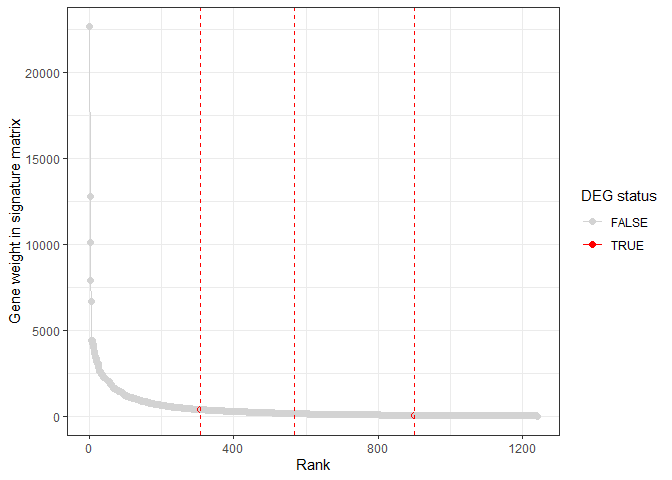

VisualizationDeconvolution
================
Marco Tello
2024-02-14

### Four cell types deconvolution:

We used the subset of the Haemosphere dataset, and the phenotype file
required by CIERSORTx to generate a signature matrix file, which
identifies the relevance of each gene as a marker for one of the four
target cell types. Please note that the weights in the following heatmap
were scaled gene-wise (row-wise) to better visualize the relevance
across cell types.

``` r
signature_matrix <- fread("~/GitHub/CellDecon/output/CIBERSORTx/signature_one2one.txt", drop = 1)
names(signature_matrix) <- str_replace(string = names(signature_matrix), 
                                       pattern = " Lineage", replacement = "")
pheatmap(signature_matrix, scale = "row", show_rownames = FALSE, legend_labels = "weight")
```

<!-- -->
Subsequently, we used this signature matrix to estimate the cell type
proportions in our blood samples.

### Cell fractions visualization

First we download the results from the CIBERSORTx page and load them
into R.

``` r
fractions <- fread("~/GitHub/CellDecon/output/CIBERSORTx/fractions_Sone2one_Mone2one_newExp.txt")
names(fractions) <- str_replace(str_replace(names(fractions), pattern = " Lineage", replacement = ""), pattern = " ", replacement = "")

fractions[, Mixture := gsub(Mixture, pattern = "-", replacement = ".", x = Mixture)] 
fractions <- fractions[, .SD, .SDcols = c("Mixture","BCell","TCell","Macrophage","Neutrophil")]
```

``` r
plot_data <- fractions 
plot_data <- melt(plot_data, id.vars = "Mixture", variable.name = "CellType", value.name = "Fraction")
plot_data[, Condition := "CSAA"]
plot_data[grepl(pattern =  "CSAAPTS", x = Mixture), Condition := "CSAA_PTS"]
plot_data[, Mixture := str_extract(Mixture, "_[0-9]+.")]
plot_data[, Mixture := str_replace(Mixture, pattern = "_", replacement = "")]
plot_data[, Mixture := str_replace(Mixture, pattern = "\\.", replacement =  "")]

ggplot(plot_data, aes(x=Mixture, y=Fraction, fill = CellType)) +
    geom_bar(stat = "identity")+
    facet_wrap(~Condition, scales = "free_x") + 
    theme_bw()
```

<!-- -->

### DEG overlap with signature matrix

It is also important to verify that the overlap of the dientified DEGs
with the genes used to deconvolute cell types

``` r
signature_matrix <- fread("~/GitHub/CellDecon/output/CIBERSORTx/signature_one2one.txt")
decon_DE <- fread("~/GitHub/CellDecon/output/DESeq2/decon_DEG.tsv", select = 1:2)
decon_DE[, Decon := TRUE]
standard_DE <- fread("~/GitHub/CellDecon/output/DESeq2/standard_DEG.tsv", select = 1:2)
standard_DE[, Standard := TRUE]

DEGs <- merge.data.table(x = decon_DE, y = standard_DE, all = TRUE)
DEGs <- DEGs[ENSEMBL %in% signature_matrix$NAME]
```

The following plot shows the weight assigned by CIBERSORTx to each gene
in the signature matrix. A high weight, indicates a high relevance
during deconvolution. In red, I highlighted the genes from the signature
matrix that overlap with the set of DEGs.

``` r
weight_sum <- data.table(gene = signature_matrix$NAME, 
                         weight = rowSums(signature_matrix[,2:5])) 
setorder(weight_sum, -weight)
weight_sum[, rank := 1:nrow(weight_sum)]
weight_sum[, shared := FALSE]
weight_sum[ gene %in% DEGs$ENSEMBL, shared := TRUE]

DEG_weights <- weight_sum[shared == TRUE, rank]
ggplot(weight_sum, aes(x=rank, y=weight, color=shared))+
  geom_line() +
  geom_point(size = 3, alpha = 0.2) +
  scale_color_manual(values = c("lightgrey", "red")) +
  geom_vline(xintercept = DEG_weights, linetype = "dashed", color="red", linewidth = 1)
```

<!-- -->

The lowest rank among overlapping genes was 130 for the gene Parp12.
This result suggest that the set of DEGs was not highly involved in the
determination of cell fractions.
