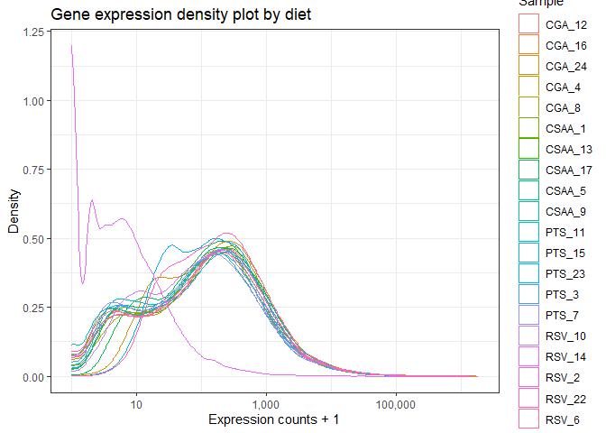
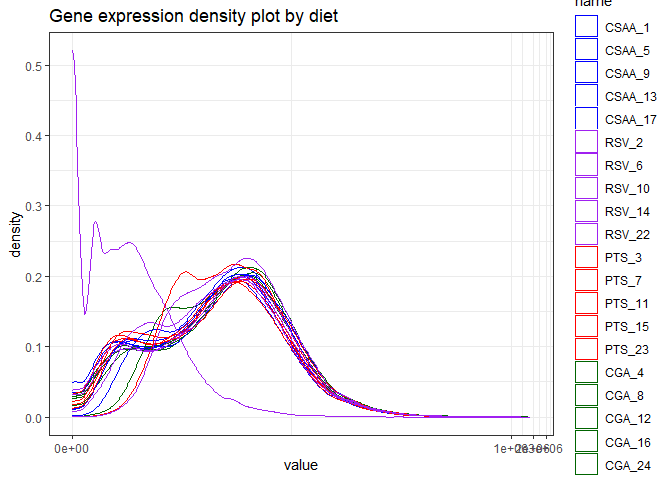
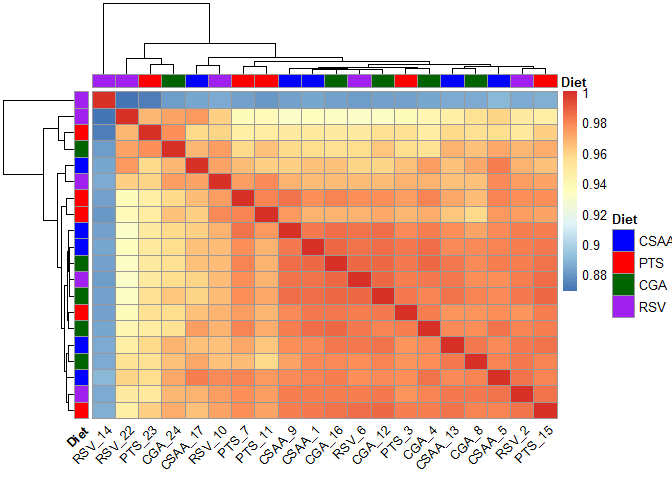

EDA
================
Marco Tello
2024-02-22

# Exploratory Data Analysis

Once we have the final count table, we can analyze the distribution of
counts per sample and possible variables that could influence our
results.

## Count distribution

We looked at the density distribution of gene expression values for all
samples. This will help us to identify outlier samples in the gene
expression data.

``` r
# Read count table
# We remove last sample which is not properly identified
count_df <- fread(file.path(data_path, "count_df.tsv"), 
                  select = c("ENSEMBLID", "GeneSymbol", "Length", 
                             "CSAA.1_024547.1", "CSAA.5_024548.5", "CSAA.9_024549.9",
                             "CSAA.13_024550.13", "CSAA.17_024551.17", "CSAAPTS.3_024557.3",
                             "CSAAPTS.7_024558.7", "CSAAPTS.11_024559.11", "CSAAPTS.15_024560.15",
                             "CSAAPTS.23_024561.23")) 
count_df[1:5,1:5]
```

    ##             ENSEMBLID GeneSymbol Length CSAA.1_024547.1 CSAA.5_024548.5
    ## 1: ENSRNOG00000045838       Hps1   4483             153             189
    ## 2: ENSRNOG00000052220     Ccdc83    922               0               0
    ## 3: ENSRNOG00000018052     Cnksr3   4596              74              64
    ## 4: ENSRNOG00000020339     Neurl1   4198              20              22
    ## 5: ENSRNOG00000028746      Gsto1   1096             223             257

``` r
count_df %>%
  dplyr::select(!ENSEMBLID) %>%
  dplyr::select(!Length) %>%
  pivot_longer(!GeneSymbol) %>%
  dplyr::select(!GeneSymbol) %>%
  ggplot(aes(x=value, color = name))+
    geom_density() +
    scale_x_continuous(trans = 'log10') +
    labs(title = "Gene expression density plot")
```

<!-- -->

``` r
temp <- count_df %>%
  dplyr::select(!ENSEMBLID) %>%
  dplyr::select(!Length) %>%
  pivot_longer(!GeneSymbol) %>%
  dplyr::select(!GeneSymbol) %>%
  mutate(condition = str_replace(string = name, 
                                 pattern = ".\\d+", 
                                 replacement = "")) %>%
  mutate(condition = str_replace(string = condition, 
                                 pattern = "_\\d{6}.\\d+", 
                                 replacement = "")) %>%
  mutate(condition = case_when(
    condition == "CSAA" ~ "#377EB8",
    condition == "CSAAPTS" ~ "#FF7F00")) 
  
temp %>%
  ggplot(aes(x=value, color= name))+
  geom_density() +
  scale_color_manual(values=temp$condition) +
  scale_x_continuous(trans = 'log10') +
  labs(title = "Gene expression density plot by diet")
```

<!-- -->

We initially observed one sample that do not completely follow the
distribution of counts as the others. Thus we colored them by diet group
so we could identify which diet group it belongs. In this way, we
flagged sample **024561** as an outlier with a different distribution of
counts compared to other samples. The next step is to remove lowly
expressed genes and check if the density plots improve.

### Filter lowly expressed genes

To increase data quality we removed lowly expressed genes in two steps:

1.  Removed genes with no counts across all samples.

2.  Removed genes with less than two reads in more than half of the
    samples.

Following this strategy we kept 14,450 protein coding genes from the
initial 20,124. We used a threshold of minimum 2 reads in more than half
of the samples for keeping any gene. This value was determined by the
average of the first quartile from all samples.

``` r
# Remove columns with gene information 
exp_mat <- data.frame(count_df[,4:ncol(count_df)])
rownames(exp_mat) <- count_df$GeneSymbol

# Remove rows with all 10 entries equal zero
exp_mat <- exp_mat[!(rowSums(exp_mat == 0) == 10),]

# We use the average 1st quartile as threshold (2.1), round down to 2
# floor(mean(apply(exp_mat, MARGIN = 2, quantile, 0.25)))

# Select genes to keep
min_reads <- 2
min_samples <- ncol(exp_mat)/2
genes_to_keep <- apply(exp_mat >= min_reads, MARGIN = 1, sum) > min_samples

# Final gene count matrix
exp_mat <- exp_mat[genes_to_keep,]
```

``` r
# temp <- data.table(rownames_to_column(exp_mat, var = "GeneSymbol"))
# temp <- merge.data.table(x = temp[, .SD, .SDcols = "GeneSymbol"], y = count_df, by = "GeneSymbol")
# temp[, GeneSymbol := NULL]
# fwrite(x = temp, file = file.path(data_path, "filtered_counts_Rnorv6.tsv"), append = FALSE, quote = FALSE, sep = '\t', row.names = FALSE, col.names = TRUE)
```

``` r
exp_mat %>%
  rownames_to_column(var = "GeneSymbol") %>%
  pivot_longer(!GeneSymbol) %>%
  dplyr::select(!GeneSymbol) %>%
  ggplot(aes(x=value, color= name))+
    geom_density() +
    scale_x_continuous(trans = 'log10')
```

<!-- -->

``` r
temp <- exp_mat %>%
  rownames_to_column(var = "GeneSymbol") %>%
  pivot_longer(!GeneSymbol) %>%
  mutate(condition = str_replace(string = name, 
                            pattern = ".\\d+", 
                            replacement = "")) %>%
  mutate(condition = str_replace(string = condition, 
                            pattern = "_\\d{6}.\\d+", 
                            replacement = "")) %>%
  mutate(condition = case_when(
    condition == "CSAA_CGA" ~ "#E41A1C",
    condition == "CSAA" ~ "#377EB8",
    condition == "CSAAPTS" ~ "#FF7F00",
    condition == "CSAARSV" ~ "#984EA3")) %>% 
  dplyr::select(!GeneSymbol) 
temp %>%
  ggplot(aes(x=value, color= name))+
    geom_density() +
    scale_color_manual(values=temp$condition) +
    scale_x_continuous(trans = 'log10', labels = scales::comma) +
    labs(x = "")
```

<!-- -->

This step made most samples distributions to look mostly similar.

## CPM normalization

Before proceeding to further analysis we need to normalize the gene
counts, we will use *counts per million* (CPM) to adjust for library
size and transform it to log space for better visualization.

``` r
# CPM normalization and transform to log2
expr_log2cpm <- cpm(exp_mat, log = TRUE, prior.count = 1) %>% 
  data.frame() 

expr_log2cpm %>%
  rownames_to_column(var = "GeneSymbol") %>%
  pivot_longer(!GeneSymbol) %>%
  dplyr::select(!GeneSymbol) %>%
  ggplot(aes(x=value, color= name))+
  geom_density() 
```

<!-- -->

### Violin plots

To directly compare sample gene expression distribution without overlap
between density plots we generated the respective violin plots

``` r
temp <- expr_log2cpm %>%
  rownames_to_column(var="GeneSymbol") %>%
  pivot_longer(!GeneSymbol) %>%
  mutate(Diet = str_replace(string = name, 
                            pattern = ".\\d+", 
                            replacement = "")) %>%
  mutate(Diet = str_replace(string = Diet, 
                            pattern = "_\\d{6}.\\d+", 
                            replacement = "")) %>%
  mutate(color_class = case_when(
    Diet == "CSAA_CGA" ~ "#E41A1C",
    Diet == "CSAA" ~ "#377EB8",
    Diet == "CSAAPTS" ~ "#FF7F00",
    Diet == "CSAARSV" ~ "#984EA3")) %>% 
  dplyr::select(!GeneSymbol) 
temp %>%
  ggplot(aes(x=name, y=value, fill = Diet)) +
  geom_violin()+
  theme(axis.text.x = element_text(angle = 45, hjust=1)) +
  scale_color_manual(values=temp$color_class)
```

<!-- -->

In this way we can easily identify that sample **024561** has a
different distribution, with a lower proportion of genes with low
log2CPM values

### Sample-sample correlation plot

Using normalized counts we generated a plot to observe if there is
correlation within diet groups which would group the samples
accordingly.

``` r
# Annotation

# Standardize conditon names
condition <- names(expr_log2cpm) %>%
  str_replace(pattern = ".\\d+", replacement = "") %>%
  str_replace(pattern = "_\\d{6}.\\d+", replacement = "") %>%
  str_replace(pattern = "CSAARSV", replacement = "RSV") %>%
  str_replace(pattern = "CSAAPTS", replacement = "PTS") %>%
  str_replace(pattern = "CSAA_CGA", replacement = "CGA")

annot <- data.frame(Diet = as.factor(condition),
                    row.names = names(expr_log2cpm))

annot_colors <- list(Diet = c(CSAA = "#377EB8", 
                              PTS = "#FF7F00"))

# Heatmap            
expr_log2cpm %>%
  cor() %>%
  pheatmap(annotation_col = annot,
           annotation_row = annot,
           show_rownames = FALSE, 
           annotation_colors = annot_colors,
           labels_col = str_extract(string = names(expr_log2cpm), pattern = "[0-9]{6}"), 
           angle_col = 45)
```

<!-- -->

In this case, the samples did not cluster by diet. The next step is to
perform a principal component analysis to further investigate this low
correlation within diet groups.

### Principal Component Analysis (PCA) analysis

Another way of determining relationship between the samples is through a
PCA analysis, which reduces the dimentionality of our data to a set of
independent variables (principal components) that represent the major
proportion of variability in our data.

``` r
PCs <- prcomp(t(cpm(exp_mat)), center = TRUE, scale = TRUE)
# Scree plot 
fviz_eig(PCs)
```

<!-- -->

``` r
# Scatter plot
eig_val <- get_eigenvalue(PCs)
PCs <- cbind(annot, PCs$x[,1:10])
PCs$sample_id <- rownames(PCs)

PCs %>%
  mutate(color_class = case_when(
    Diet == "CSAA" ~ "#377EB8",
    Diet == "PTS" ~ "#FF7F00")) %>%
  ggplot(aes(x = PC1, y = PC2, 
             color = color_class)) + 
  geom_point(aes(size = 8)) +
  scale_color_discrete(name = "Diet", labels = unique(PCs$Diet)) + 
  labs(x= paste("PC1 (",round(eig_val$variance.percent[1], 2),"%)", sep = ""),
       y= paste("PC2 (",round(eig_val$variance.percent[2], 2),"%)", sep = ""))+
  guides(size = "none") +
  geom_text(label = ifelse(PCs$sample_id == "CSAARSV.14_024555.14", "024555", ""), nudge_x = -9)
```

<!-- -->

PCA analysis confirmed that differences between diets are not the
primary source of variability in the dataset, being the second PC the
most associated with diet differernces (14.78% of variance explained by
this PC). Additional metadata is required to evaluate other associations
driving most of the variability in the dataset (i.e. PC1).

## Variance stabilized counts visualization.

We observed a random clustering of the samples in both sample-sample
correlation and PCA analysis. This could be caused because the majority
of genes have a low variance while a handful are highly variable. To
improve visualization we used the `vst` function from `DESeq2`.

``` r
expr_vst <- vst(object = as.matrix(sapply(exp_mat, as.integer))) %>%
  data.frame(row.names = rownames(expr_log2cpm))
```

``` r
expr_vst %>%
  rownames_to_column(var = "GeneSymbol") %>%
  pivot_longer(!GeneSymbol) %>%
  dplyr::select(!GeneSymbol) %>%
  ggplot(aes(x=value, color= name))+
  geom_density() +
  scale_x_continuous(trans = 'log10')
```

<!-- -->

``` r
temp <- expr_vst %>%
  rownames_to_column(var = "GeneSymbol") %>%
  pivot_longer(!GeneSymbol) %>%
  mutate(condition = str_replace(string = name, 
                                 pattern = ".\\d+", 
                                 replacement = "")) %>%
  mutate(condition = str_replace(string = condition, 
                                 pattern = "_\\d{6}.\\d+", 
                                 replacement = "")) %>%
  mutate(condition = case_when(
    condition == "CSAA" ~ "#377EB8",
    condition == "CSAAPTS" ~ "#FF7F00")) %>% 
  dplyr::select(!GeneSymbol) 
temp %>%
  ggplot(aes(x=value, color= name))+
  geom_density() +
  scale_color_manual(values=temp$condition) +
  scale_x_continuous(trans = 'log10', labels = scales::comma) +
  labs(x = "VST")
```

<!-- -->

VST count transformation improved the visualization of the gene
expression values for every sample.

### Violin plots

This can also be appreciated using violin plots for representing the VST
counts per sample.

``` r
temp <- expr_vst %>%
  rownames_to_column(var="GeneSymbol") %>%
  pivot_longer(!GeneSymbol) %>%
  mutate(diet = str_replace(string = name, 
                            pattern = ".\\d+", 
                            replacement = "")) %>%
  mutate(diet = str_replace(string = diet, 
                            pattern = "_\\d{6}.\\d+", 
                            replacement = "")) %>%
  mutate(color_class = case_when(
    diet == "CSAA" ~ "#377EB8",
    diet == "CSAAPTS" ~ "#FF7F00")) %>% 
  dplyr::select(!GeneSymbol) 
temp %>%
  ggplot(aes(x=name, y=value, fill = diet)) +
  geom_violin()+
  theme(axis.text.x = element_text(angle = 45, hjust=1)) +
  scale_color_manual(values=temp$color_class)
```

<!-- -->

### Sample-sample correlation plot

Next, we calculated the correlation between samples using VST counts.
Unfortunately, sample clustering still looks random to some degree.

``` r
# Annotation
annot <- data.frame(Diet = as.factor(condition),
                    row.names = names(expr_vst))

annot_colors <- list(Diet = c(CSAA = "#377EB8", 
                              PTS = "#FF7F00"))
# Heatmap            
expr_vst %>%
  cor() %>%
  pheatmap(annotation_col = annot,
           annotation_row = annot,
           show_rownames = FALSE, 
           annotation_colors = annot_colors,
           labels_col = str_extract(string = names(expr_vst), pattern = "[0-9]{6}"), 
           angle_col = 45)
```

<!-- -->

#### Top variable genes

Since we expect subtle changes in gene expression, we can narrow the set
of genes used to calculate the correlation between samples to the 100
variable genes.

``` r
genes_to_keep <- names(sort(apply(exp_mat,
                                  MARGIN = 1,
                                  FUN = var),
                            decreasing = TRUE)[1:100])
expr_vst_top <- expr_vst %>% 
  rownames_to_column(var = "gene") %>% 
  data.table(key = "gene")

expr_vst_top <- expr_vst_top[genes_to_keep] %>% 
  column_to_rownames(var = "gene")

# Heatmap            
expr_vst_top %>%
  cor() %>%
  pheatmap(annotation_col = annot,
           annotation_row = annot,
           show_rownames = FALSE, 
           annotation_colors = annot_colors,
           labels_col = str_extract(string = names(expr_vst_top), pattern = "[0-9]{6}"), 
           angle_col = 45, treeheight_row = 0)
```

<!-- -->

Using only the top 100 variable genes clearly improved sample
clustering, now it is possible to identify two clusters enriched for
samples of specific diet groups. This result makes sense with the
expected variability in the data.

### PCA analysis

Our final EDA exploration is a PCA using VST counts.

``` r
# PCA analysis
PCs <- prcomp(t(expr_vst), center = TRUE, scale = TRUE)
# Scree plot 
fviz_eig(PCs)
```

<!-- -->

``` r
# Scatter plot
eig_val <- get_eigenvalue(PCs)
PCs <- cbind(annot, PCs$x[,1:10])
PCs$sample_id <- str_extract(string = rownames(PCs), pattern = "[0-9]{6}")


PCs %>% 
  mutate(color_class = case_when(
    Diet == "CSAA" ~ "#377EB8",
    Diet == "PTS" ~ "#FF7F00",)) %>%
  ggplot(aes(x = PC1, y = PC2, color = Diet)) + 
  geom_point(aes(size = 8)) +
  scale_color_discrete(name = "Diet") +
  labs(x= paste("PC1 (",round(eig_val$variance.percent[1], 2),"%)", sep = ""),
       y= paste("PC2 (",round(eig_val$variance.percent[2], 2),"%)", sep = ""))+
  guides(size = FALSE) +
  geom_text(label = ifelse(PCs$sample_id == "024555", "024555", ""), nudge_y = -10, nudge_x = 10)
```

    ## Warning: The `<scale>` argument of `guides()` cannot be `FALSE`. Use "none" instead as
    ## of ggplot2 3.3.4.

<!-- -->

Using VST counts did not significatively improved the separation between
diets, however it did reduce the variance explained by the first
component from 53.5% to 35.3% indicating an overall reduction of
variability in the data due to groups of genes with different variance.

## EDA conclusions

Initial visualization of gene counts suggested sample **024561** to be
an outlier due to a different distribution of reads, however, this
difference was ameliorated when removing lowly expressed genes and
normalizing by library size. It was not possible to cluster samples by
dietary conditions using raw counts nor CPM counts; sample
correlationresulted in an apparently random clustering. While PCA
analysis indicated a separation between diet conditions along the second
principal component. The clustering within samples of the same diet
group was improved when using a combination of VST counts, and a subset
of the top 100 variable genes. Together, our results suggest that
differences between diets account for a limited amount of variability in
the data, while most could be influenced by unknown sources of
variability within diet groups. It is also possible that differences
between diet groups could be limited to very few genes (less than a
100).
