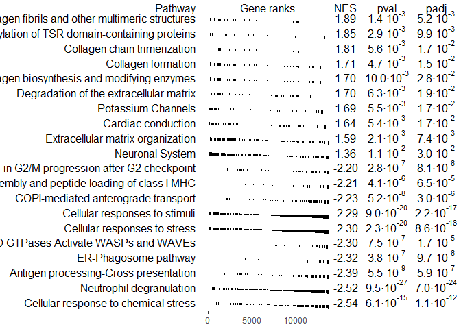
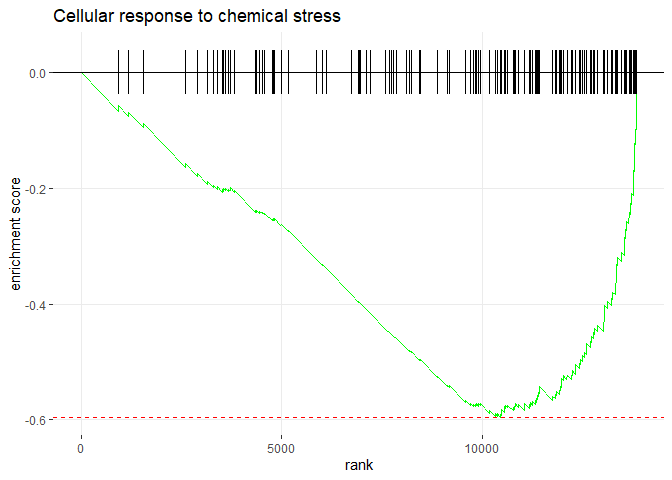
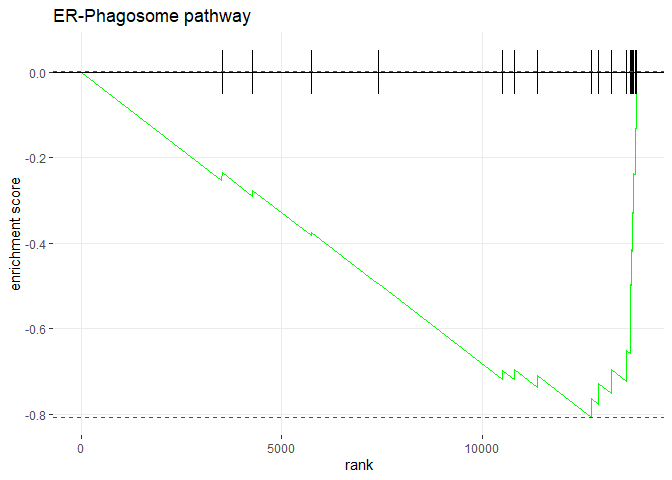
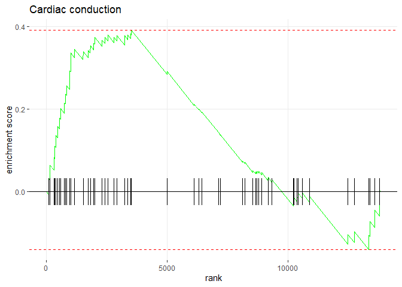

fGSEA
================
Marco Tello
2024-02-16

``` r
decon_DE <- fread("~/GitHub/CellDecon/output/DESeq2/decon_DESeq_full.tsv")

base_DEGs <- fread("~/GitHub/CellDecon/output/DESeq2/standard_DEG.tsv", 
                   select = c(1,2,4), 
                   col.names = c("ENSEMBL","Symbol", "baseFC"))
base_DEGs[, baseFC := 2^abs(baseFC) * sign(baseFC)]

decon_DEGs <- fread("~/GitHub/CellDecon/output/DESeq2/decon_DEG.tsv", 
                    select = c(1,2,4), 
                    col.names = c("ENSEMBL","Symbol", "deconFC"))
decon_DEGs[, deconFC := 2^abs(deconFC) * sign(deconFC)]

DEG_full <- merge.data.table(x = base_DEGs, y = decon_DEGs, all = TRUE)
```

## Gene Set Enrichment Analysis

``` r
# Filter to keep only entries with GeneSymbol
# Prepare elements for doing a query in biomaRt
# ENSEMBL genes
ensembl <- useEnsembl(biomart = "genes", 
                      dataset = "rnorvegicus_gene_ensembl", 
                      version = 104)
# Generate conversion table
# Map ENSEMBL gene IDS to 
# Rat Genome Database (RGD) symbols
gene_IDs <- getBM(filters= "ensembl_gene_id", 
                  attributes= c("ensembl_gene_id",
                                "rgd_symbol", 
                                "entrezgene_id", 
                                "entrezgene_accession"),
                  values = decon_DE$ENSEMBL, 
                  mart= ensembl)
gene_IDs <- as.data.table(na.omit(gene_IDs))

# # Verify new IDS
# new_ensembl <- useEnsembl(biomart = "genes", 
#                           dataset = "rnorvegicus_gene_ensembl")
# 
# new_IDs <- getBM(filters= "rgd_symbol", 
#                   attributes= c("ensembl_gene_id",
#                                 "rgd_symbol", 
#                                 "entrezgene_id", 
#                                 "entrezgene_accession"),
#                   values = gene_IDs$rgd_symbol, 
#                   mart = new_ensembl)
# gene_IDs <- as.data.table(new_IDs)
```

``` r
# Add column
dDEG_PTS <- merge.data.table(x = gene_IDs, y = decon_DE, 
                             by.x = "ensembl_gene_id", 
                             by.y = "ENSEMBL", 
                             all.x = FALSE)
setorder(dDEG_PTS, -stat)

DEG_full <- merge.data.table(x = gene_IDs, y = DEG_full, 
                             by.x = "ensembl_gene_id", 
                             by.y = "ENSEMBL", 
                             all.x = FALSE)

# Remove duplicated entrez
dup_entrez <- na.omit(unique(dDEG_PTS$entrezgene_id[duplicated(dDEG_PTS$entrezgene_id)]))
avg_stat <- na.omit(dDEG_PTS[(entrezgene_id %in% dup_entrez)])[, .(stat = mean(stat)), by = entrezgene_id]

dDEG_PTS_nodup <- na.omit(dDEG_PTS[!(entrezgene_id %in% dup_entrez)])

dPTS_ranks <- c(dDEG_PTS_nodup$stat, avg_stat$stat)
names(dPTS_ranks) <- c(dDEG_PTS_nodup$entrezgene_id, avg_stat$entrezgene_id)
dPTS_ranks <- sort(dPTS_ranks, decreasing = TRUE)

# Get reactome pathways for our genes
pathways <- reactomePathways(names(dPTS_ranks))
```

    ## 'select()' returned 1:many mapping between keys and columns

    ## 'select()' returned 1:1 mapping between keys and columns

``` r
set.seed(123)
fgsea_dPTS <- fgsea(pathways = pathways,
                    stats = dPTS_ranks,
                    minSize = 15,
                    maxSize = 500,
                    eps = 0.0)
```

    ## Warning in preparePathwaysAndStats(pathways, stats, minSize, maxSize, gseaParam, : There are ties in the preranked stats (2.47% of the list).
    ## The order of those tied genes will be arbitrary, which may produce unexpected results.

### Overview of top pathways

``` r
topPathwaysUp <- fgsea_dPTS[ES > 0 & padj < 0.05][head(order(-NES), n=10), pathway]
topPathwaysDown <- fgsea_dPTS[ES < 0 & padj < 0.05][head(order(NES), n=10), pathway]
topPathways <- c(topPathwaysUp, rev(topPathwaysDown))
plotGseaTable(pathways[topPathways], dPTS_ranks, fgsea_dPTS, 
              gseaParam=0.5)
```

<!-- -->

### Top down-regulated pathways

``` r
pathway_name <- topPathwaysDown[1]
plotEnrichment(pathway = pathways[[pathway_name]], 
               stats = dPTS_ranks) + labs(title=pathway_name)
```

<!-- -->

``` r
pathway_genes <- pathways[[pathway_name]]

unique(DEG_full[entrezgene_id %in% pathway_genes][, .(Symbol, baseFC, deconFC)])
```

    ##     Symbol    baseFC   deconFC
    ##     <char>     <num>     <num>
    ##  1:   Txn2        NA -2.131431
    ##  2:  Psmf1        NA -1.966111
    ##  3:  Psmc5        NA -1.546341
    ##  4:  Psmc3        NA -1.472786
    ##  5:  Gstp1        NA -1.993179
    ##  6:  Cox5a        NA -1.695041
    ##  7: Hba-a1 -2.152461 -2.716200
    ##  8: Hba-a3        NA -5.311185
    ##  9: Hba-a2        NA -3.123547
    ## 10:    Hbb        NA -3.392314

``` r
pathway_name <- topPathwaysDown[2]
plotEnrichment(pathway = pathways[[pathway_name]], 
               stats = dPTS_ranks) + labs(title=pathway_name)
```

<!-- -->

``` r
pathway_genes <- pathways[[pathway_name]]
unique(DEG_full[entrezgene_id %in% pathway_genes][, .(Symbol, baseFC, deconFC)])
```

    ##           Symbol    baseFC   deconFC
    ##           <char>     <num>     <num>
    ##  1:       RT1-S3        NA -1.700174
    ##  2:       RT1-N3        NA -1.647353
    ##  3:       Csnk2b -1.600866        NA
    ##  4:        Pdap1        NA -1.599661
    ##  5:        Itgb2        NA -1.647252
    ##  6:         Hpse        NA -1.682347
    ##  7:        Actr2        NA -1.518832
    ##  8:         Cd63        NA -1.767772
    ##  9:       Cyb5r3        NA -1.920235
    ## 10:        Psmc3        NA -1.472786
    ## 11:        Rab7a        NA -1.882784
    ## 12:         Alad        NA -2.211516
    ## 13:        P2rx1        NA -1.744262
    ## 14:        Gstp1        NA -1.993179
    ## 15: LOC100360087        NA -1.919994
    ## 16:       Fcgr3a        NA -1.702447
    ## 17:       RT1-N2        NA -1.866159
    ## 18:       RT1-A2        NA -1.605199
    ## 19:         Ftl1        NA -1.951631
    ## 20:      RT1-CE3        NA -1.697787
    ## 21:     RT1-M6-2        NA -1.668896
    ## 22:       Sting1 -1.542699        NA
    ## 23:       Rab27a        NA -1.769143
    ## 24:          Hbb        NA -3.392314
    ## 25:         Bst2        NA -4.372745
    ##           Symbol    baseFC   deconFC

``` r
pathway_name <- topPathwaysDown[3]
plotEnrichment(pathway = pathways[[pathway_name]], 
               stats = dPTS_ranks) + labs(title=pathway_name)
```

<!-- -->

``` r
pathway_genes <- pathways[[pathway_name]]
unique(DEG_full[entrezgene_id %in% pathway_genes][, .(Symbol, baseFC, deconFC)])
```

    ##       Symbol baseFC   deconFC
    ##       <char>  <num>     <num>
    ##  1:   RT1-S3     NA -1.700174
    ##  2:   RT1-N3     NA -1.647353
    ##  3:    Psmf1     NA -1.966111
    ##  4:    Psmc5     NA -1.546341
    ##  5:    Psmc3     NA -1.472786
    ##  6:   RT1-N2     NA -1.866159
    ##  7:    Tapbp     NA -2.143966
    ##  8:   RT1-A2     NA -1.605199
    ##  9:  RT1-CE3     NA -1.697787
    ## 10: RT1-M6-2     NA -1.668896

``` r
pathway_name <- topPathwaysDown[4]
plotEnrichment(pathway = pathways[[pathway_name]], 
               stats = dPTS_ranks) + labs(title=pathway_name)
```

<!-- -->

``` r
pathway_genes <- pathways[[pathway_name]]
unique(DEG_full[entrezgene_id %in% pathway_genes][, .(Symbol, baseFC, deconFC)])
```

    ##      Symbol baseFC   deconFC
    ##      <char>  <num>     <num>
    ## 1:   RT1-S3     NA -1.700174
    ## 2:   RT1-N3     NA -1.647353
    ## 3:   RT1-N2     NA -1.866159
    ## 4:    Tapbp     NA -2.143966
    ## 5:   RT1-A2     NA -1.605199
    ## 6:  RT1-CE3     NA -1.697787
    ## 7: RT1-M6-2     NA -1.668896

``` r
pathway_name <- topPathwaysDown[5]
plotEnrichment(pathway = pathways[[pathway_name]], 
               stats = dPTS_ranks) + labs(title=pathway_name)
```

<!-- -->

``` r
pathway_genes <- pathways[[pathway_name]]
unique(DEG_full[entrezgene_id %in% pathway_genes][, .(Symbol, baseFC, deconFC)])
```

    ##    Symbol baseFC   deconFC
    ##    <char>  <num>     <num>
    ## 1:  Actr2     NA -1.518832
    ## 2:   Actb     NA -2.134105

``` r
pathway_name <- topPathwaysDown[6]
plotEnrichment(pathway = pathways[[pathway_name]], 
               stats = dPTS_ranks) + labs(title=pathway_name)
```

<!-- -->

``` r
pathway_genes <- pathways[[pathway_name]]
unique(DEG_full[entrezgene_id %in% pathway_genes][, .(Symbol, baseFC, deconFC)])
```

    ##     Symbol    baseFC   deconFC
    ##     <char>     <num>     <num>
    ##  1: Tuba4a        NA -1.915051
    ##  2:   Txn2        NA -2.131431
    ##  3: Dynll2        NA -2.176723
    ##  4:  Psmf1        NA -1.966111
    ##  5:  Psmc5        NA -1.546341
    ##  6:  Psmc3        NA -1.472786
    ##  7:  Hsbp1        NA -1.485672
    ##  8:  Ube2c        NA -2.033627
    ##  9: Tubb2b        NA -1.593484
    ## 10: Tubb2a        NA -1.574827
    ## 11:  Gstp1        NA -1.993179
    ## 12:  Cox5a        NA -1.695041
    ## 13: Hba-a1 -2.152461 -2.716200
    ## 14: Hba-a3        NA -5.311185
    ## 15: Hba-a2        NA -3.123547
    ## 16:    Hbb        NA -3.392314

``` r
pathway_name <- topPathwaysDown[7]
plotEnrichment(pathway = pathways[[pathway_name]], 
               stats = dPTS_ranks) + labs(title=pathway_name)
```

<!-- -->

``` r
pathway_genes <- pathways[[pathway_name]]
unique(DEG_full[entrezgene_id %in% pathway_genes][, .(Symbol, baseFC, deconFC)])
```

    ##     Symbol    baseFC   deconFC
    ##     <char>     <num>     <num>
    ##  1: Tuba4a        NA -1.915051
    ##  2:   Txn2        NA -2.131431
    ##  3: Dynll2        NA -2.176723
    ##  4:  Psmf1        NA -1.966111
    ##  5:  Psmc5        NA -1.546341
    ##  6:  Psmc3        NA -1.472786
    ##  7:  Hsbp1        NA -1.485672
    ##  8:  Ube2c        NA -2.033627
    ##  9: Tubb2b        NA -1.593484
    ## 10: Tubb2a        NA -1.574827
    ## 11:  Gstp1        NA -1.993179
    ## 12:  Cox5a        NA -1.695041
    ## 13: Hba-a1 -2.152461 -2.716200
    ## 14: Hba-a3        NA -5.311185
    ## 15: Hba-a2        NA -3.123547
    ## 16:    Hbb        NA -3.392314

``` r
pathway_name <- topPathwaysDown[8]
plotEnrichment(pathway = pathways[[pathway_name]], 
               stats = dPTS_ranks) + labs(title=pathway_name)
```

<!-- -->

``` r
pathway_genes <- pathways[[pathway_name]]
unique(DEG_full[entrezgene_id %in% pathway_genes][, .(Symbol, baseFC, deconFC)])
```

    ##    Symbol    baseFC   deconFC
    ##    <char>     <num>     <num>
    ## 1: Tuba4a        NA -1.915051
    ## 2: Dynll2        NA -2.176723
    ## 3: Golga2 -1.413644        NA
    ## 4: Tubb2b        NA -1.593484
    ## 5: Tubb2a        NA -1.574827

``` r
pathway_name <- topPathwaysDown[10]
plotEnrichment(pathway = pathways[[pathway_name]], 
               stats = dPTS_ranks) + labs(title=pathway_name)
```

<!-- -->

``` r
pathway_genes <- pathways[[pathway_name]]
unique(DEG_full[entrezgene_id %in% pathway_genes][, .(Symbol, baseFC, deconFC)])
```

    ##    Symbol baseFC   deconFC
    ##    <char>  <num>     <num>
    ## 1: Tuba4a     NA -1.915051
    ## 2:  Psmf1     NA -1.966111
    ## 3:  Psmc5     NA -1.546341
    ## 4:  Psmc3     NA -1.472786
    ## 5: Tubb2b     NA -1.593484
    ## 6: Tubb2a     NA -1.574827

### Top up-regulated pathways

``` r
pathway_name <- topPathwaysUp[8]
plotEnrichment(pathway = pathways[[pathway_name]], 
               stats = dPTS_ranks) + labs(title=pathway_name)
```

<!-- -->

``` r
pathway_genes <- pathways[[pathway_name]]
unique(DEG_full[entrezgene_id %in% pathway_genes][, .(Symbol, baseFC, deconFC)])
```

    ##    Symbol    baseFC   deconFC
    ##    <char>     <num>     <num>
    ## 1: Atp2a3 -1.843847 -1.991379

``` r
pathway_name <- topPathwaysUp[9]
plotEnrichment(pathway = pathways[[pathway_name]], 
               stats = dPTS_ranks) + labs(title=pathway_name)
```

<!-- -->

``` r
pathway_genes <- pathways[[pathway_name]]
unique(DEG_full[entrezgene_id %in% pathway_genes][, .(Symbol, baseFC, deconFC)])
```

    ##    Symbol baseFC   deconFC
    ##    <char>  <num>     <num>
    ## 1:  Itgb2     NA -1.647252
    ## 2:  Itgb3     NA -1.789875

``` r
pathway_name <- topPathwaysUp[10]
plotEnrichment(pathway = pathways[[pathway_name]], 
               stats = dPTS_ranks) + labs(title=pathway_name)
```

<!-- -->

``` r
pathway_genes <- pathways[[pathway_name]]
unique(DEG_full[entrezgene_id %in% pathway_genes][, .(Symbol, baseFC, deconFC)])
```

    ##    Symbol baseFC   deconFC
    ##    <char>  <num>     <num>
    ## 1: Slc6a4     NA -1.687029
    ## 2: Dlgap4     NA -1.851046
    ## 3:   Glul     NA -1.664214

# Notes on specific genes

### Hbe1, Hba-a1, and Hbb

Upon inspection of molecular function from DEGs using Panther, the
following differentially expressed genes are associated with antioxidant
activity (<GO:0016209>). According to study PMID: 30965648, HBE1 is a
candidate protein associated with the development of radiation
resistance in colorectal cancer. According to study PMID: 33042024, HBE1
was upregulated in rats’ heart after exposure to a high-fat diet.
According to study PMID: 25472829, Hba-a1 and Hbb-b1 expression was
positively associated with social stress in rats.

``` r
unique(DEG_full[rgd_symbol %in% c("Hbe1", "Hbb", "Hba-a1")][, .(Symbol, baseFC, deconFC)])
```

    ##    Symbol    baseFC   deconFC
    ##    <char>     <num>     <num>
    ## 1:   Hbe1        NA -5.082036
    ## 2: Hba-a1 -2.152461 -2.716200
    ## 3:    Hbb        NA -3.392314

### Cell immunity

Although Panther associates Crp with “Grpcb” as the gene symbol, and
annotates Grpcb as an extracellular peptide involved in antimocrobial
response, there were not independent studies supporting this role. Crp
was the only gene upregulated in this category, while all other
immunity-related genes with differential expression were down-regulated.

RT1-N2, RT1-A1, RT1-T24-4, RT1-S3, and RT1-A2 were annotated by Panther
as involved in the major histocompatibility complex protein.

``` r
immunity_DEGs <- c("Fcgr3a", "Tapbp", "Crp", "RT1-N2", "RT1-CE3", "Klhl25", "RT1-A1", "RT1-T24-4", "RT1-S3", "RT1-A2", "Lgals3bp", "Pltp")

temp <- setorder(unique(DEG_full[rgd_symbol %in% immunity_DEGs][, .(Symbol, baseFC, deconFC)]), -deconFC)
temp
```

    ##        Symbol    baseFC   deconFC
    ##        <char>     <num>     <num>
    ##  1:       Crp        NA  2.660508
    ##  2:    RT1-A1        NA -1.546235
    ##  3:    RT1-A2        NA -1.605199
    ##  4:   RT1-CE3        NA -1.697787
    ##  5:    RT1-S3        NA -1.700174
    ##  6:    Fcgr3a        NA -1.702447
    ##  7:    Klhl25        NA -1.746611
    ##  8: RT1-T24-4        NA -1.808172
    ##  9:    RT1-N2        NA -1.866159
    ## 10:     Tapbp        NA -2.143966
    ## 11:  Lgals3bp -1.925565 -2.377831
    ## 12:      Pltp        NA -2.498127
