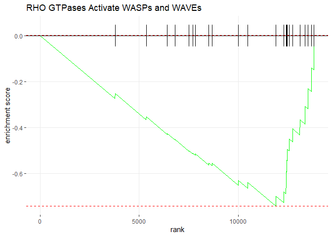
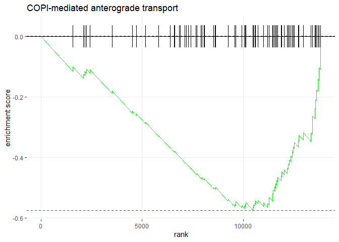
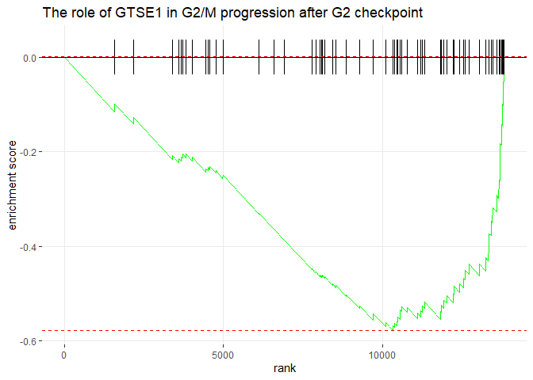
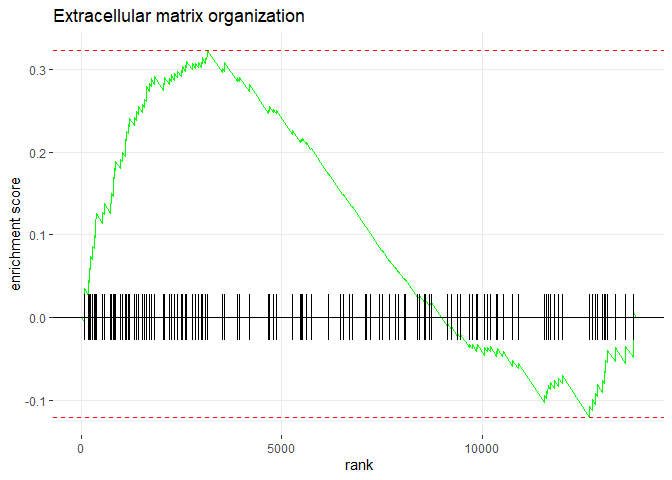
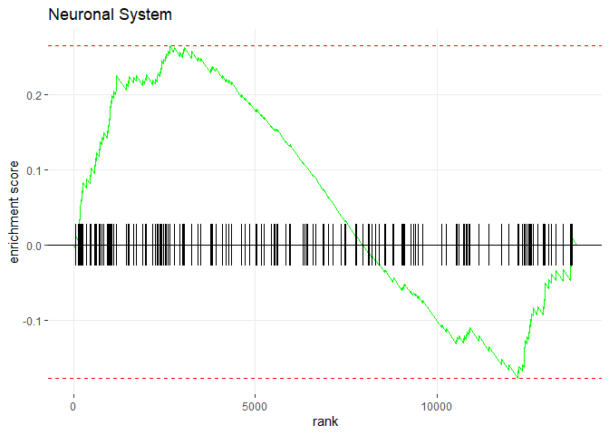

fGSEA
================
Marco Tello
2024-02-16

``` r
decon_DE <- fread("~/GitHub/CellDecon/output/DESeq2/decon_DESeq_full.tsv")

base_DEGs <- fread("~/GitHub/CellDecon/output/DESeq2/standard_DEG.tsv", select = c(1,2,4), col.names = c("ENSEMBL","Symbol", "baseFC"))
decon_DEGs <- fread("~/GitHub/CellDecon/output/DESeq2/decon_DEG.tsv", select = c(1,2,4), col.names = c("ENSEMBL","Symbol", "deconFC"))
DEG_full <- merge.data.table(x = base_DEGs, y = decon_DEGs, all = TRUE)
```

## Gene Set Enrichment Analysis

``` r
# Filter to keep only entries with GeneSymbol
# Prepare elements for doing a query in biomaRt
# ENSEMBL genes
ensembl <- useEnsembl(biomart = "genes", 
                      dataset = "rnorvegicus_gene_ensembl", version = 110)
# Generate conversion table
# Map ENSEMBL gene IDS to 
# Rat Genome Database (RGD) symbols
gene_IDs <- getBM(filters= "ensembl_gene_id", 
                  attributes= c("ensembl_gene_id","rgd_symbol", "entrezgene_id", "entrezgene_accession"),
                  values = decon_DE$ensembl_gene_id, 
                  mart= ensembl)
gene_IDs <- as.data.table(gene_IDs)
```

``` r
# Add column
dDEG_PTS <- merge.data.table(x = gene_IDs, y = decon_DE, 
                             by.x = "ensembl_gene_id", by.y = "ensembl_gene_id", all.x = FALSE)
setorder(dDEG_PTS, -stat)

DEG_full <- merge.data.table(x = gene_IDs, y = DEG_full, 
                             by.x = "ensembl_gene_id", by.y = "ENSEMBL", all.x = FALSE)

# Remove duplicated entrez
dup_entrez <- na.omit(unique(dDEG_PTS$entrezgene_id[duplicated(dDEG_PTS$entrezgene_id)]))
avg_stat <- na.omit(dDEG_PTS[(entrezgene_id %in% dup_entrez)])[, .(stat = mean(stat)), by = entrezgene_id]

dDEG_PTS_nodup <- na.omit(dDEG_PTS[!(entrezgene_id %in% dup_entrez)])

dPTS_ranks <- c(dDEG_PTS_nodup$stat, avg_stat$stat)
names(dPTS_ranks) <- c(dDEG_PTS_nodup$entrezgene_id, avg_stat$entrezgene_id)
dPTS_ranks <- sort(dPTS_ranks, decreasing = TRUE)

# Get reactome pathways for our genes
pathways <- reactomePathways(names(dPTS_ranks))
```

    ## 'select()' returned 1:many mapping between keys and columns

    ## 'select()' returned 1:1 mapping between keys and columns

``` r
set.seed(123)
fgsea_dPTS <- fgsea(pathways = pathways,
                    stats = dPTS_ranks,
                    minSize = 15,
                    maxSize = 500,
                    eps = 0.0)
```

    ## Warning in preparePathwaysAndStats(pathways, stats, minSize, maxSize, gseaParam, : There are ties in the preranked stats (1.61% of the list).
    ## The order of those tied genes will be arbitrary, which may produce unexpected results.

### Overview of top pathways

``` r
topPathwaysUp <- fgsea_dPTS[ES > 0 & padj < 0.05][head(order(-NES), n=10), pathway]
topPathwaysDown <- fgsea_dPTS[ES < 0 & padj < 0.05][head(order(NES), n=10), pathway]
topPathways <- c(topPathwaysUp, rev(topPathwaysDown))
plotGseaTable(pathways[topPathways], dPTS_ranks, fgsea_dPTS, 
              gseaParam=0.5)
```

<!-- -->

### Top down-regulated pathways

``` r
pathway_name <- topPathwaysDown[1]
plotEnrichment(pathway = pathways[[pathway_name]], 
               stats = dPTS_ranks) + labs(title=pathway_name)
```

<!-- -->

``` r
pathway_genes <- pathways[[pathway_name]]

unique(DEG_full[entrezgene_id %in% pathway_genes][, .(Symbol, baseFC, deconFC)])
```

    ##    Symbol    baseFC    deconFC
    ## 1:   Txn2        NA -1.0918227
    ## 2:  Psmf1        NA -0.9753450
    ## 3:  Psmc5        NA -0.6288587
    ## 4:  Psmc3        NA -0.5585477
    ## 5:  Gstp1        NA -0.9950710
    ## 6:  Cox5a        NA -0.7613204
    ## 7: Hba-a1 -1.092999 -1.4415896
    ## 8:    Hbb        NA -1.8062539
    ## 9: Hba-a3        NA -1.6431851

``` r
pathway_name <- topPathwaysDown[2]
plotEnrichment(pathway = pathways[[pathway_name]], 
               stats = dPTS_ranks) + labs(title=pathway_name)
```

<!-- -->

``` r
pathway_genes <- pathways[[pathway_name]]
unique(DEG_full[entrezgene_id %in% pathway_genes][, .(Symbol, baseFC, deconFC)])
```

    ##       Symbol     baseFC    deconFC
    ##  1:     Psap         NA -0.4875164
    ##  2:   RT1-S3         NA -0.7656824
    ##  3:   RT1-N3         NA -0.7201501
    ##  4:   Csnk2b -0.6865707         NA
    ##  5:    Pdap1         NA -0.6777664
    ##  6:    Itgb2         NA -0.7200614
    ##  7:     Hpse         NA -0.7504753
    ##  8:    Actr2         NA -0.6029622
    ##  9:     Cd63         NA -0.8219320
    ## 10:   Cyb5r3         NA -0.9412830
    ## 11:    Psmc3         NA -0.5585477
    ## 12:    Rab7a         NA -0.9128672
    ## 13:     Alad         NA -1.1450359
    ## 14:    P2rx1         NA -0.8026168
    ## 15:    Gstp1         NA -0.9950710
    ## 16:   Fcgr3a         NA -0.7676098
    ## 17:   RT1-N2         NA -0.9000722
    ## 18: RT1-M6-2         NA -0.7388942
    ## 19:   Sting1         NA -0.6427278
    ## 20:      Hbb         NA -1.8062539
    ## 21:   Rab27a         NA -0.8230504
    ## 22:     Bst2         NA -2.1285392
    ##       Symbol     baseFC    deconFC

``` r
pathway_name <- topPathwaysDown[3]
plotEnrichment(pathway = pathways[[pathway_name]], 
               stats = dPTS_ranks) + labs(title=pathway_name)
```

<!-- -->

``` r
pathway_genes <- pathways[[pathway_name]]
unique(DEG_full[entrezgene_id %in% pathway_genes][, .(Symbol, baseFC, deconFC)])
```

    ##      Symbol baseFC    deconFC
    ## 1:   RT1-S3     NA -0.7656824
    ## 2:   RT1-N3     NA -0.7201501
    ## 3:    Psmf1     NA -0.9753450
    ## 4:    Psmc5     NA -0.6288587
    ## 5:    Psmc3     NA -0.5585477
    ## 6:   RT1-N2     NA -0.9000722
    ## 7:    Tapbp     NA -1.1002821
    ## 8: RT1-M6-2     NA -0.7388942

``` r
pathway_name <- topPathwaysDown[4]
plotEnrichment(pathway = pathways[[pathway_name]], 
               stats = dPTS_ranks) + labs(title=pathway_name)
```

<!-- -->

``` r
pathway_genes <- pathways[[pathway_name]]
unique(DEG_full[entrezgene_id %in% pathway_genes][, .(Symbol, baseFC, deconFC)])
```

    ##    Symbol baseFC    deconFC
    ## 1:  Actr2     NA -0.6029622
    ## 2:   Actb     NA -1.0936309

``` r
pathway_name <- topPathwaysDown[5]
plotEnrichment(pathway = pathways[[pathway_name]], 
               stats = dPTS_ranks) + labs(title=pathway_name)
```

<!-- -->

``` r
pathway_genes <- pathways[[pathway_name]]
unique(DEG_full[entrezgene_id %in% pathway_genes][, .(Symbol, baseFC, deconFC)])
```

    ##     Symbol    baseFC    deconFC
    ##  1: Tuba4a        NA -0.9373831
    ##  2:   Txn2        NA -1.0918227
    ##  3: Dynll2        NA -1.1221575
    ##  4:  Psmf1        NA -0.9753450
    ##  5:  Psmc5        NA -0.6288587
    ##  6:  Psmc3        NA -0.5585477
    ##  7:  Hsbp1        NA -0.5711153
    ##  8:  Ube2c        NA -1.0240552
    ##  9: Tubb2b        NA -0.6721844
    ## 10: Tubb2a        NA -0.6551935
    ## 11:  Gstp1        NA -0.9950710
    ## 12:  Cox5a        NA -0.7613204
    ## 13: Hba-a1 -1.092999 -1.4415896
    ## 14:    Hbb        NA -1.8062539
    ## 15: Hba-a3        NA -1.6431851
    ## 16:   H1f5        NA -0.6958948

``` r
pathway_name <- topPathwaysDown[6]
plotEnrichment(pathway = pathways[[pathway_name]], 
               stats = dPTS_ranks) + labs(title=pathway_name)
```

<!-- -->

``` r
pathway_genes <- pathways[[pathway_name]]
unique(DEG_full[entrezgene_id %in% pathway_genes][, .(Symbol, baseFC, deconFC)])
```

    ##     Symbol    baseFC    deconFC
    ##  1: Tuba4a        NA -0.9373831
    ##  2:   Txn2        NA -1.0918227
    ##  3: Dynll2        NA -1.1221575
    ##  4:  Psmf1        NA -0.9753450
    ##  5:  Psmc5        NA -0.6288587
    ##  6:  Psmc3        NA -0.5585477
    ##  7:  Hsbp1        NA -0.5711153
    ##  8:  Ube2c        NA -1.0240552
    ##  9: Tubb2b        NA -0.6721844
    ## 10: Tubb2a        NA -0.6551935
    ## 11:  Gstp1        NA -0.9950710
    ## 12:  Cox5a        NA -0.7613204
    ## 13: Hba-a1 -1.092999 -1.4415896
    ## 14:    Hbb        NA -1.8062539
    ## 15: Hba-a3        NA -1.6431851
    ## 16:   H1f5        NA -0.6958948

``` r
pathway_name <- topPathwaysDown[7]
plotEnrichment(pathway = pathways[[pathway_name]], 
               stats = dPTS_ranks) + labs(title=pathway_name)
```

<!-- -->

``` r
pathway_genes <- pathways[[pathway_name]]
unique(DEG_full[entrezgene_id %in% pathway_genes][, .(Symbol, baseFC, deconFC)])
```

    ##    Symbol     baseFC    deconFC
    ## 1: Tuba4a         NA -0.9373831
    ## 2: Dynll2         NA -1.1221575
    ## 3: Golga2 -0.5074159         NA
    ## 4: Tubb2b         NA -0.6721844
    ## 5: Tubb2a         NA -0.6551935

``` r
pathway_name <- topPathwaysDown[8]
plotEnrichment(pathway = pathways[[pathway_name]], 
               stats = dPTS_ranks) + labs(title=pathway_name)
```

<!-- -->

``` r
pathway_genes <- pathways[[pathway_name]]
unique(DEG_full[entrezgene_id %in% pathway_genes][, .(Symbol, baseFC, deconFC)])
```

    ##    Symbol baseFC    deconFC
    ## 1: Tuba4a     NA -0.9373831
    ## 2:  Psmf1     NA -0.9753450
    ## 3:  Psmc5     NA -0.6288587
    ## 4:  Psmc3     NA -0.5585477
    ## 5: Tubb2b     NA -0.6721844
    ## 6: Tubb2a     NA -0.6551935

``` r
pathway_name <- topPathwaysDown[10]
plotEnrichment(pathway = pathways[[pathway_name]], 
               stats = dPTS_ranks) + labs(title=pathway_name)
```

<!-- -->

``` r
pathway_genes <- pathways[[pathway_name]]
unique(DEG_full[entrezgene_id %in% pathway_genes][, .(Symbol, baseFC, deconFC)])
```

    ##    Symbol    baseFC    deconFC
    ## 1:  Cox5a        NA -0.7613204
    ## 2: Hba-a1 -1.092999 -1.4415896
    ## 3:    Hbb        NA -1.8062539
    ## 4: Hba-a3        NA -1.6431851

### Top up-regulated pathways

``` r
pathway_name <- topPathwaysUp[8]
plotEnrichment(pathway = pathways[[pathway_name]], 
               stats = dPTS_ranks) + labs(title=pathway_name)
```

<!-- -->

``` r
pathway_genes <- pathways[[pathway_name]]
unique(DEG_full[entrezgene_id %in% pathway_genes][, .(Symbol, baseFC, deconFC)])
```

    ##    Symbol baseFC    deconFC
    ## 1:  Itgb2     NA -0.7200614
    ## 2:  Itgb3     NA -0.8398587

``` r
pathway_name <- topPathwaysUp[9]
plotEnrichment(pathway = pathways[[pathway_name]], 
               stats = dPTS_ranks) + labs(title=pathway_name)
```

<!-- -->

``` r
pathway_genes <- pathways[[pathway_name]]
unique(DEG_full[entrezgene_id %in% pathway_genes][, .(Symbol, baseFC, deconFC)])
```

    ##    Symbol     baseFC   deconFC
    ## 1: Atp2a3 -0.8907295 -0.993768

``` r
pathway_name <- topPathwaysUp[10]
plotEnrichment(pathway = pathways[[pathway_name]], 
               stats = dPTS_ranks) + labs(title=pathway_name)
```

<!-- -->

``` r
pathway_genes <- pathways[[pathway_name]]
unique(DEG_full[entrezgene_id %in% pathway_genes][, .(Symbol, baseFC, deconFC)])
```

    ##    Symbol baseFC    deconFC
    ## 1: Slc6a4     NA -0.7544848
    ## 2: Dlgap4     NA -0.8883410
    ## 3:   Glul     NA -0.7348410

# Notes on specific genes

### Hbe1, Hba-a1, and Hbb

Upon inspection of molecular function from DEGs using Panther, the
following differentially expressed genes are associated with antioxidant
activity (<GO:0016209>). According to study PMID: 30965648, HBE1 is a
candidate protein associated with the development of radiation
resistance in colorectal cancer. According to study PMID: 33042024, HBE1
was upregulated in rats’ heart after exposure to a high-fat diet.
According to study PMID: 25472829, Hba-a1 and Hbb-b1 expression was
positively associated with social stress in rats.

``` r
unique(DEG_full[rgd_symbol %in% c("Hbe1", "Hbb", "Hba-a1")][, .(Symbol, baseFC, deconFC)])
```

    ##    Symbol    baseFC   deconFC
    ## 1:   Hbe1        NA -2.345407
    ## 2: Hba-a1 -1.092999 -1.441590
    ## 3:    Hbb        NA -1.806254

### Cell immunity

Although Panther associates Crp with “Grpcb” as the gene symbol, and
annotates Grpcb as an extracellular peptide involved in antimocrobial
response, there were not independent studies supporting this role. Crp
was the only gene upregulated in this category, while all other
immunity-related genes with differential expression were down-regulated.

RT1-N2, RT1-A1, RT1-T24-4, RT1-S3, and RT1-A2 were annotated by Panther
as involved in the major histocompatibility complex protein.

``` r
immunity_DEGs <- c("Fcgr3a", "Tapbp", "Crp", "RT1-N2", "RT1-CE3", "Klhl25", "RT1-A1", "RT1-T24-4", "RT1-S3", "RT1-A2", "Lgals3bp", "Pltp")

temp <- setorder(unique(DEG_full[rgd_symbol %in% immunity_DEGs][, .(Symbol, baseFC, deconFC)]), -deconFC)
temp
```

    ##        Symbol     baseFC    deconFC
    ##  1:       Crp         NA  1.4117020
    ##  2:    RT1-A1         NA -0.6287595
    ##  3:    RT1-A2         NA -0.6827520
    ##  4:   RT1-CE3         NA -0.7636556
    ##  5:    RT1-S3         NA -0.7656824
    ##  6:    Fcgr3a         NA -0.7676098
    ##  7:    Klhl25         NA -0.8045587
    ##  8: RT1-T24-4         NA -0.8545320
    ##  9:    RT1-N2         NA -0.9000722
    ## 10:     Tapbp         NA -1.1002821
    ## 11:  Lgals3bp -0.9521341 -1.2496460
    ## 12:      Pltp         NA -1.3208466
