fGSEA
================
Marco Tello
2024-02-16

``` r
decon_DE <- fread("~/GitHub/CellDecon/output/DESeq2/decon_DESeq_full.tsv")
```

## Gene Set Enrichment Analysis

``` r
# Filter to keep only entries with GeneSymbol
# Prepare elements for doing a query in biomaRt
# ENSEMBL genes
ensembl <- useEnsembl(biomart = "genes", 
                      dataset = "rnorvegicus_gene_ensembl", version = 110)
# Generate conversion table
# Map ENSEMBL gene IDS to 
# Rat Genome Database (RGD) symbols
gene_IDs <- getBM(filters= "ensembl_gene_id", 
                  attributes= c("ensembl_gene_id","rgd_symbol", "entrezgene_id", "entrezgene_accession"),
                  values = decon_DE$Gene, 
                  mart= ensembl)
gene_IDs <- as.data.table(gene_IDs)
```

``` r
# Add column
dDEG_PTS <- merge.data.table(x = gene_IDs, y = decon_DE, 
                             by.x = "ensembl_gene_id", by.y = "Gene", all.x = FALSE)
setorder(dDEG_PTS, -stat)

# Remove duplicated entrez
dup_entrez <- na.omit(unique(dDEG_PTS$entrezgene_id[duplicated(dDEG_PTS$entrezgene_id)]))
avg_stat <- na.omit(dDEG_PTS[(entrezgene_id %in% dup_entrez)])[, .(stat = mean(stat)), by = entrezgene_id]

dDEG_PTS_nodup <- na.omit(dDEG_PTS[!(entrezgene_id %in% dup_entrez)])

dPTS_ranks <- c(dDEG_PTS_nodup$stat, avg_stat$stat)
names(dPTS_ranks) <- c(dDEG_PTS_nodup$entrezgene_id, avg_stat$entrezgene_id)
dPTS_ranks <- sort(dPTS_ranks, decreasing = TRUE)

# Get reactome pathways for our genes
pathways <- reactomePathways(names(dPTS_ranks))
```

    ## 'select()' returned 1:many mapping between keys and columns

    ## 'select()' returned 1:1 mapping between keys and columns

``` r
set.seed(123)
fgsea_dPTS <- fgsea(pathways = pathways,
                    stats = dPTS_ranks,
                    minSize = 15,
                    maxSize = 500,
                    eps = 0.0)
```

    ## Warning in preparePathwaysAndStats(pathways, stats, minSize, maxSize, gseaParam, : There are ties in the preranked stats (1.62% of the list).
    ## The order of those tied genes will be arbitrary, which may produce unexpected results.

### Overview of top pathways

``` r
topPathwaysUp <- fgsea_dPTS[ES > 0 & padj < 0.05][head(order(-NES), n=10), pathway]
topPathwaysDown <- fgsea_dPTS[ES < 0 & padj < 0.05][head(order(NES), n=10), pathway]
topPathways <- c(topPathwaysUp, rev(topPathwaysDown))
plotGseaTable(pathways[topPathways], dPTS_ranks, fgsea_dPTS, 
              gseaParam=0.5)
```

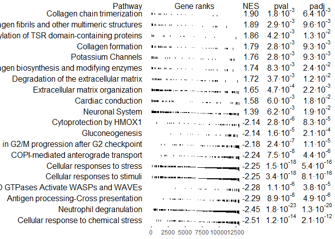<!-- -->

### Top down-regulated pathways

``` r
pathway_name <- topPathwaysDown[1]
plotEnrichment(pathway = pathways[[pathway_name]], 
               stats = dPTS_ranks) + labs(title=pathway_name)
```

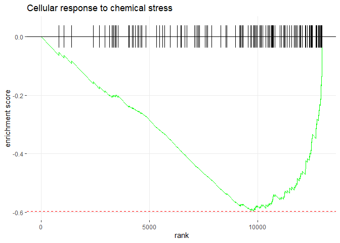<!-- -->

``` r
pathway_genes <- pathways[[pathway_name]]
dDEG_PTS[entrezgene_id %in% pathway_genes][padj < 0.05][, .(ensembl_gene_id, rgd_symbol, log2FoldChange)]
```

    ##        ensembl_gene_id   rgd_symbol log2FoldChange
    ##  1: ENSRNOG00000011414        Psmc3     -0.5585477
    ##  2: ENSRNOG00000018816        Cox5a     -0.7613204
    ##  3: ENSRNOG00000010038        Psmc5     -0.6288587
    ##  4: ENSRNOG00000005614         Txn2     -1.0918227
    ##  5: ENSRNOG00000009640        Psmf1     -0.9753450
    ##  6: ENSRNOG00000047098          Hbb     -1.8062539
    ##  7: ENSRNOG00000047098 LOC100134871     -1.8062539
    ##  8: ENSRNOG00000047098       Hbb-bs     -1.8062539
    ##  9: ENSRNOG00000047098       Hbb-b1     -1.8062539
    ## 10: ENSRNOG00000047098       Hbb-b2     -1.8062539
    ## 11: ENSRNOG00000018237        Gstp1     -0.9950710
    ## 12: ENSRNOG00000029886       Hba-a1     -1.4415896
    ## 13: ENSRNOG00000029886       Hba-a1     -1.4415896
    ## 14: ENSRNOG00000029886       Hba-a2     -1.4415896
    ## 15: ENSRNOG00000029886       Hba-a2     -1.4415896
    ## 16: ENSRNOG00000029886        Hbq1b     -1.4415896
    ## 17: ENSRNOG00000029886        Hbq1b     -1.4415896
    ## 18: ENSRNOG00000047321       Hba-a2     -1.6431851
    ## 19: ENSRNOG00000047321       Hba-a3     -1.6431851

``` r
pathway_name <- topPathwaysDown[2]
plotEnrichment(pathway = pathways[[pathway_name]], 
               stats = dPTS_ranks) + labs(title=pathway_name)
```

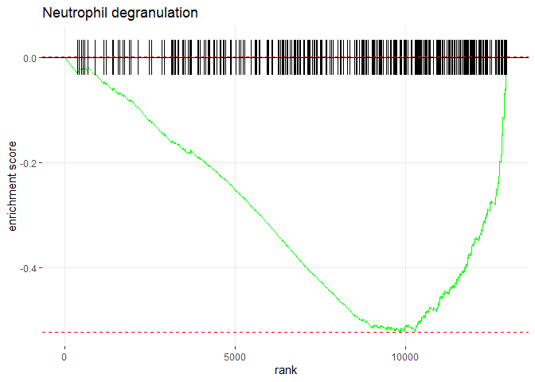<!-- -->

``` r
pathway_genes <- pathways[[pathway_name]]
dDEG_PTS[entrezgene_id %in% pathway_genes][padj < 0.05][, .(ensembl_gene_id, rgd_symbol, log2FoldChange)]
```

    ##        ensembl_gene_id   rgd_symbol log2FoldChange
    ##  1: ENSRNOG00000007650         Cd63     -0.8219320
    ##  2: ENSRNOG00000000777       RT1-S3     -0.7656824
    ##  3: ENSRNOG00000011414        Psmc3     -0.5585477
    ##  4: ENSRNOG00000000990        Pdap1     -0.6777664
    ##  5: ENSRNOG00000004959        Actr2     -0.6029622
    ##  6: ENSRNOG00000052499       Rab27a     -0.8230504
    ##  7: ENSRNOG00000029386       RT1-N2     -0.9000722
    ##  8: ENSRNOG00000017606        P2rx1     -0.8026168
    ##  9: ENSRNOG00000000571         Psap     -0.4875164
    ## 10: ENSRNOG00000040052     RT1-M6-1     -0.7388942
    ## 11: ENSRNOG00000040052     RT1-M6-2     -0.7388942
    ## 12: ENSRNOG00000001224        Itgb2     -0.7200614
    ## 13: ENSRNOG00000024382       Fcgr3a     -0.7676098
    ## 14: ENSRNOG00000009592       Cyb5r3     -0.9412830
    ## 15: ENSRNOG00000002188         Hpse     -0.7504753
    ## 16: ENSRNOG00000012247        Rab7a     -0.9128672
    ## 17: ENSRNOG00000000795       RT1-N3     -0.7201501
    ## 18: ENSRNOG00000047098          Hbb     -1.8062539
    ## 19: ENSRNOG00000047098 LOC100134871     -1.8062539
    ## 20: ENSRNOG00000047098       Hbb-bs     -1.8062539
    ## 21: ENSRNOG00000047098       Hbb-b1     -1.8062539
    ## 22: ENSRNOG00000047098       Hbb-b2     -1.8062539
    ## 23: ENSRNOG00000015206         Alad     -1.1450359
    ## 24: ENSRNOG00000018237        Gstp1     -0.9950710
    ## 25: ENSRNOG00000059900         Bst2     -2.1285392
    ##        ensembl_gene_id   rgd_symbol log2FoldChange

``` r
pathway_name <- topPathwaysDown[3]
plotEnrichment(pathway = pathways[[pathway_name]], 
               stats = dPTS_ranks) + labs(title=pathway_name)
```

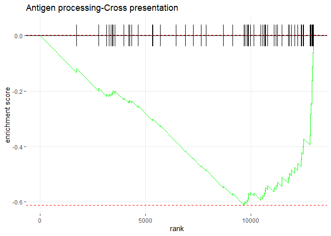<!-- -->

``` r
pathway_genes <- pathways[[pathway_name]]
dDEG_PTS[entrezgene_id %in% pathway_genes][padj < 0.05][, .(ensembl_gene_id, rgd_symbol, log2FoldChange)]
```

    ##       ensembl_gene_id rgd_symbol log2FoldChange
    ## 1: ENSRNOG00000000777     RT1-S3     -0.7656824
    ## 2: ENSRNOG00000011414      Psmc3     -0.5585477
    ## 3: ENSRNOG00000029386     RT1-N2     -0.9000722
    ## 4: ENSRNOG00000010038      Psmc5     -0.6288587
    ## 5: ENSRNOG00000040052   RT1-M6-1     -0.7388942
    ## 6: ENSRNOG00000040052   RT1-M6-2     -0.7388942
    ## 7: ENSRNOG00000009640      Psmf1     -0.9753450
    ## 8: ENSRNOG00000000795     RT1-N3     -0.7201501
    ## 9: ENSRNOG00000029500      Tapbp     -1.1002821

``` r
pathway_name <- topPathwaysDown[4]
plotEnrichment(pathway = pathways[[pathway_name]], 
               stats = dPTS_ranks) + labs(title=pathway_name)
```

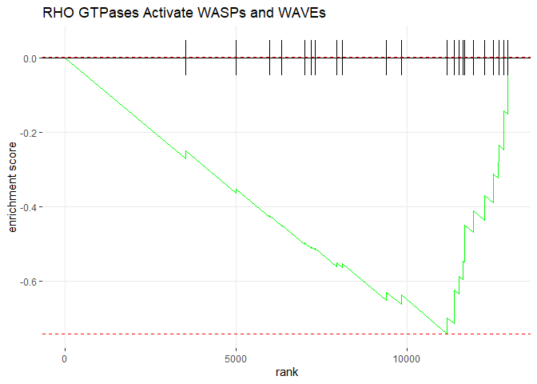<!-- -->

``` r
pathway_genes <- pathways[[pathway_name]]
dDEG_PTS[entrezgene_id %in% pathway_genes][padj < 0.05][, .(ensembl_gene_id, rgd_symbol, log2FoldChange)]
```

    ##       ensembl_gene_id rgd_symbol log2FoldChange
    ## 1: ENSRNOG00000004959      Actr2     -0.6029622
    ## 2: ENSRNOG00000034254       Actb     -1.0936309

``` r
pathway_name <- topPathwaysDown[5]
plotEnrichment(pathway = pathways[[pathway_name]], 
               stats = dPTS_ranks) + labs(title=pathway_name)
```

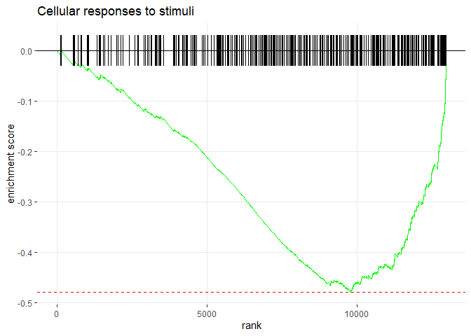<!-- -->

``` r
pathway_genes <- pathways[[pathway_name]]
dDEG_PTS[entrezgene_id %in% pathway_genes][padj < 0.05][, .(ensembl_gene_id, rgd_symbol, log2FoldChange)]
```

    ##        ensembl_gene_id   rgd_symbol log2FoldChange
    ##  1: ENSRNOG00000014415        Hsbp1     -0.5711153
    ##  2: ENSRNOG00000011414        Psmc3     -0.5585477
    ##  3: ENSRNOG00000017558       Tubb2a     -0.6551935
    ##  4: ENSRNOG00000018816        Cox5a     -0.7613204
    ##  5: ENSRNOG00000017445       Tubb2b     -0.6721844
    ##  6: ENSRNOG00000010038        Psmc5     -0.6288587
    ##  7: ENSRNOG00000005614         Txn2     -1.0918227
    ##  8: ENSRNOG00000009640        Psmf1     -0.9753450
    ##  9: ENSRNOG00000003597       Tuba4a     -0.9373831
    ## 10: ENSRNOG00000015131        Ube2c     -1.0240552
    ## 11: ENSRNOG00000008921       Dynll2     -1.1221575
    ## 12: ENSRNOG00000047098          Hbb     -1.8062539
    ## 13: ENSRNOG00000047098 LOC100134871     -1.8062539
    ## 14: ENSRNOG00000047098       Hbb-bs     -1.8062539
    ## 15: ENSRNOG00000047098       Hbb-b1     -1.8062539
    ## 16: ENSRNOG00000047098       Hbb-b2     -1.8062539
    ## 17: ENSRNOG00000018237        Gstp1     -0.9950710
    ## 18: ENSRNOG00000029886       Hba-a1     -1.4415896
    ## 19: ENSRNOG00000029886       Hba-a1     -1.4415896
    ## 20: ENSRNOG00000029886       Hba-a2     -1.4415896
    ## 21: ENSRNOG00000029886       Hba-a2     -1.4415896
    ## 22: ENSRNOG00000029886        Hbq1b     -1.4415896
    ## 23: ENSRNOG00000029886        Hbq1b     -1.4415896
    ## 24: ENSRNOG00000047321       Hba-a2     -1.6431851
    ## 25: ENSRNOG00000047321       Hba-a3     -1.6431851
    ##        ensembl_gene_id   rgd_symbol log2FoldChange

``` r
pathway_name <- topPathwaysDown[6]
plotEnrichment(pathway = pathways[[pathway_name]], 
               stats = dPTS_ranks) + labs(title=pathway_name)
```

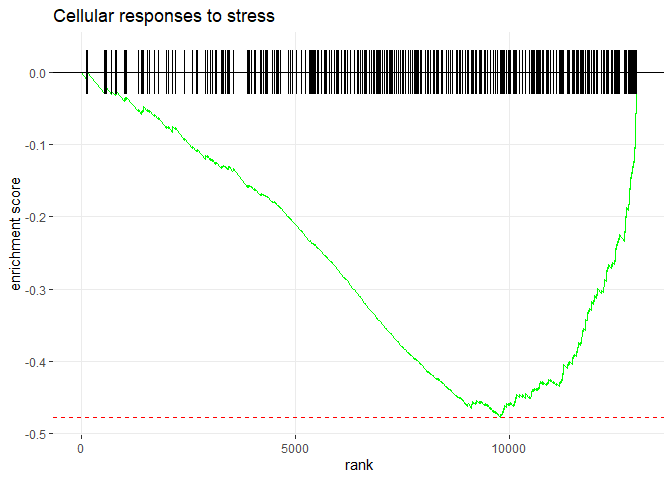<!-- -->

``` r
pathway_genes <- pathways[[pathway_name]]
dDEG_PTS[entrezgene_id %in% pathway_genes][padj < 0.05][, .(ensembl_gene_id, rgd_symbol, log2FoldChange)]
```

    ##        ensembl_gene_id   rgd_symbol log2FoldChange
    ##  1: ENSRNOG00000014415        Hsbp1     -0.5711153
    ##  2: ENSRNOG00000011414        Psmc3     -0.5585477
    ##  3: ENSRNOG00000017558       Tubb2a     -0.6551935
    ##  4: ENSRNOG00000018816        Cox5a     -0.7613204
    ##  5: ENSRNOG00000017445       Tubb2b     -0.6721844
    ##  6: ENSRNOG00000010038        Psmc5     -0.6288587
    ##  7: ENSRNOG00000005614         Txn2     -1.0918227
    ##  8: ENSRNOG00000009640        Psmf1     -0.9753450
    ##  9: ENSRNOG00000003597       Tuba4a     -0.9373831
    ## 10: ENSRNOG00000015131        Ube2c     -1.0240552
    ## 11: ENSRNOG00000008921       Dynll2     -1.1221575
    ## 12: ENSRNOG00000047098          Hbb     -1.8062539
    ## 13: ENSRNOG00000047098 LOC100134871     -1.8062539
    ## 14: ENSRNOG00000047098       Hbb-bs     -1.8062539
    ## 15: ENSRNOG00000047098       Hbb-b1     -1.8062539
    ## 16: ENSRNOG00000047098       Hbb-b2     -1.8062539
    ## 17: ENSRNOG00000018237        Gstp1     -0.9950710
    ## 18: ENSRNOG00000029886       Hba-a1     -1.4415896
    ## 19: ENSRNOG00000029886       Hba-a1     -1.4415896
    ## 20: ENSRNOG00000029886       Hba-a2     -1.4415896
    ## 21: ENSRNOG00000029886       Hba-a2     -1.4415896
    ## 22: ENSRNOG00000029886        Hbq1b     -1.4415896
    ## 23: ENSRNOG00000029886        Hbq1b     -1.4415896
    ## 24: ENSRNOG00000047321       Hba-a2     -1.6431851
    ## 25: ENSRNOG00000047321       Hba-a3     -1.6431851
    ##        ensembl_gene_id   rgd_symbol log2FoldChange

``` r
pathway_name <- topPathwaysDown[7]
plotEnrichment(pathway = pathways[[pathway_name]], 
               stats = dPTS_ranks) + labs(title=pathway_name)
```

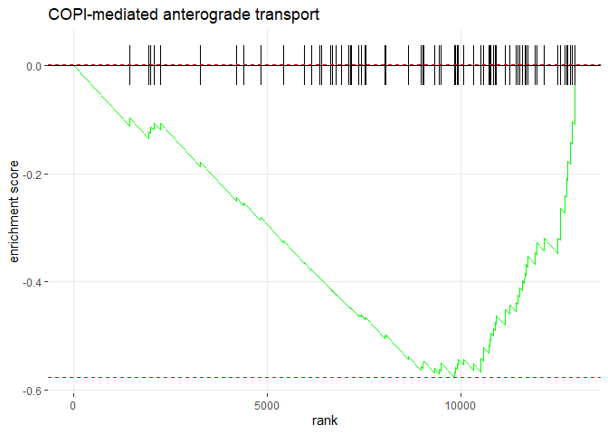<!-- -->

``` r
pathway_genes <- pathways[[pathway_name]]
dDEG_PTS[entrezgene_id %in% pathway_genes][padj < 0.05][, .(ensembl_gene_id, rgd_symbol, log2FoldChange)]
```

    ##       ensembl_gene_id rgd_symbol log2FoldChange
    ## 1: ENSRNOG00000017558     Tubb2a     -0.6551935
    ## 2: ENSRNOG00000017445     Tubb2b     -0.6721844
    ## 3: ENSRNOG00000003597     Tuba4a     -0.9373831
    ## 4: ENSRNOG00000008921     Dynll2     -1.1221575

``` r
pathway_name <- topPathwaysDown[8]
plotEnrichment(pathway = pathways[[pathway_name]], 
               stats = dPTS_ranks) + labs(title=pathway_name)
```

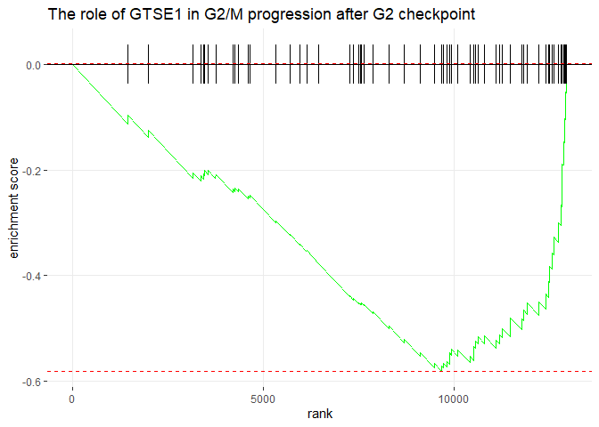<!-- -->

``` r
pathway_genes <- pathways[[pathway_name]]
dDEG_PTS[entrezgene_id %in% pathway_genes][padj < 0.05][, .(ensembl_gene_id, rgd_symbol, log2FoldChange)]
```

    ##       ensembl_gene_id rgd_symbol log2FoldChange
    ## 1: ENSRNOG00000011414      Psmc3     -0.5585477
    ## 2: ENSRNOG00000017558     Tubb2a     -0.6551935
    ## 3: ENSRNOG00000017445     Tubb2b     -0.6721844
    ## 4: ENSRNOG00000010038      Psmc5     -0.6288587
    ## 5: ENSRNOG00000009640      Psmf1     -0.9753450
    ## 6: ENSRNOG00000003597     Tuba4a     -0.9373831

``` r
pathway_name <- topPathwaysDown[10]
plotEnrichment(pathway = pathways[[pathway_name]], 
               stats = dPTS_ranks) + labs(title=pathway_name)
```

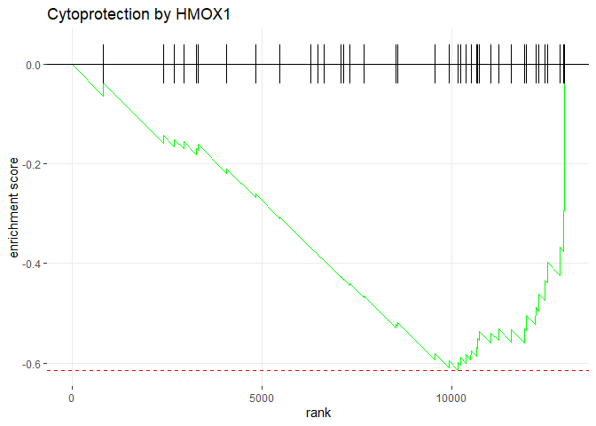<!-- -->

``` r
pathway_genes <- pathways[[pathway_name]]
dDEG_PTS[entrezgene_id %in% pathway_genes][padj < 0.05][, .(ensembl_gene_id, rgd_symbol, log2FoldChange)]
```

    ##        ensembl_gene_id   rgd_symbol log2FoldChange
    ##  1: ENSRNOG00000018816        Cox5a     -0.7613204
    ##  2: ENSRNOG00000047098          Hbb     -1.8062539
    ##  3: ENSRNOG00000047098 LOC100134871     -1.8062539
    ##  4: ENSRNOG00000047098       Hbb-bs     -1.8062539
    ##  5: ENSRNOG00000047098       Hbb-b1     -1.8062539
    ##  6: ENSRNOG00000047098       Hbb-b2     -1.8062539
    ##  7: ENSRNOG00000029886       Hba-a1     -1.4415896
    ##  8: ENSRNOG00000029886       Hba-a1     -1.4415896
    ##  9: ENSRNOG00000029886       Hba-a2     -1.4415896
    ## 10: ENSRNOG00000029886       Hba-a2     -1.4415896
    ## 11: ENSRNOG00000029886        Hbq1b     -1.4415896
    ## 12: ENSRNOG00000029886        Hbq1b     -1.4415896
    ## 13: ENSRNOG00000047321       Hba-a2     -1.6431851
    ## 14: ENSRNOG00000047321       Hba-a3     -1.6431851

### Top up-regulated pathways

``` r
pathway_name <- topPathwaysUp[8]
plotEnrichment(pathway = pathways[[pathway_name]], 
               stats = dPTS_ranks) + labs(title=pathway_name)
```

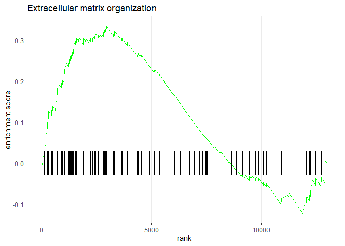<!-- -->

``` r
pathway_genes <- pathways[[pathway_name]]
dDEG_PTS[entrezgene_id %in% pathway_genes][padj < 0.05][, .(ensembl_gene_id, rgd_symbol, log2FoldChange)]
```

    ##       ensembl_gene_id rgd_symbol log2FoldChange
    ## 1: ENSRNOG00000048449      Itgb3     -0.8398587
    ## 2: ENSRNOG00000001224      Itgb2     -0.7200614

``` r
pathway_name <- topPathwaysUp[9]
plotEnrichment(pathway = pathways[[pathway_name]], 
               stats = dPTS_ranks) + labs(title=pathway_name)
```

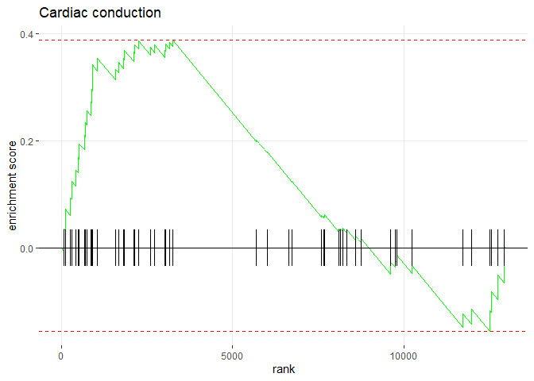<!-- -->

``` r
pathway_genes <- pathways[[pathway_name]]
dDEG_PTS[entrezgene_id %in% pathway_genes][padj < 0.05][, .(ensembl_gene_id, rgd_symbol, log2FoldChange)]
```

    ##       ensembl_gene_id rgd_symbol log2FoldChange
    ## 1: ENSRNOG00000017912     Atp2a3      -0.993768

``` r
pathway_name <- topPathwaysUp[10]
plotEnrichment(pathway = pathways[[pathway_name]], 
               stats = dPTS_ranks) + labs(title=pathway_name)
```

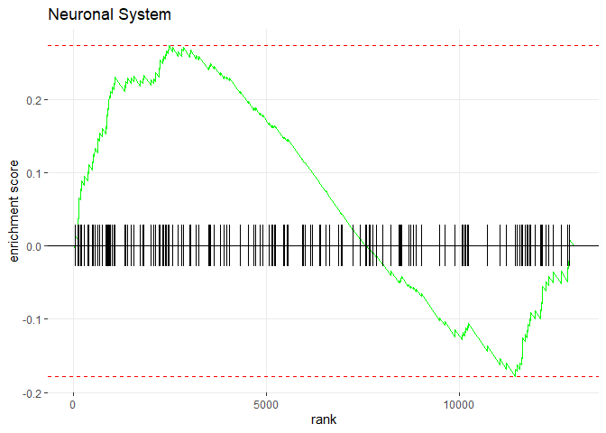<!-- -->

``` r
pathway_genes <- pathways[[pathway_name]]
dDEG_PTS[entrezgene_id %in% pathway_genes][padj < 0.05][, .(ensembl_gene_id, rgd_symbol, log2FoldChange)]
```

    ##       ensembl_gene_id rgd_symbol log2FoldChange
    ## 1: ENSRNOG00000003476     Slc6a4     -0.7544848
    ## 2: ENSRNOG00000020225     Dlgap4     -0.8883410
    ## 3: ENSRNOG00000049560       Glul     -0.7348410
